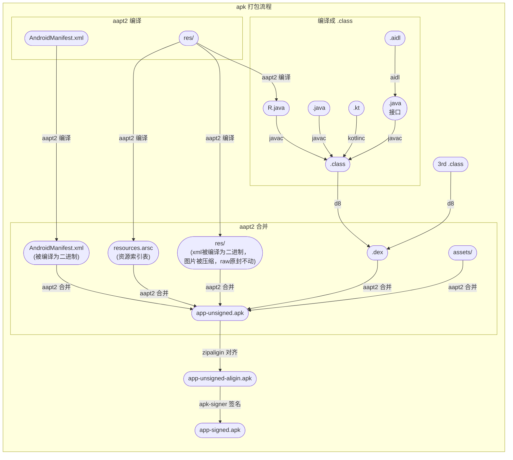

在SDK开发，Android 打包流程 是比较关注的知识点

---

### Apk 文件结构

apk是一个压缩包，解压出来得到几类文件和目录

- AndroidManigest.xml：就是 AndroidManifest.xml

- classes.dex 和 classes2.dex，可能还有classes*.dex：可以直接在Dalvik虚拟机上加载运行的文件，由java/kotlin文件经过IDE编译生成

- resources.arsc：资源索引表，二进制文件，将使用到类似 @String/name 转换为真正的 ID 引用值

- 目录 res：资源目录，包括图片、音频、icon、xml等

- 目录 META-INF：签名文件夹

---

### 打包工具

Android 的构建工具放在 `${ANDROID_HOME}/build-tools/<version_code>/` 目录下

- ~~aapt~~/aapt2：Android 资源打包工具，新版使用 `aapt2`

- aidl：Android 接口描述语言 转化为`*.java`文件的工具

- javac：Java 编译器，编译出 `*.class` 文件，目录 `${JDK_HOME}/bin/javac`

- kotlinc：Kotlin 编译器，编译出 `*.class` 文件，目录 `${IDE}/plugins/Kotlin/kotlinc/bin/kotlinc`

- ~~dex~~/d8：转化 `*.class` 文件为 Davik 虚拟机能识别的 `*.dex` 文件，新版使用 `d8` 工具

- ~~apkbuilder：生成 apk 包，新版不再提供，替代是 `${ANDROID_HOME}/tools/sdklib-<version_code>.jar` 里面的类 `com.android.sdklib.build.ApkBuilderMain`~~ 新版使用 `aapt2` 合并

- ~~jarsigner：`*.jar` 文件的签名工具，目录 `${JDK_HOME}/jarsigner`~~ 新版使用 `apksigner` 在 apk 对齐后进行 apk 的签名

- zipalign：apk 字节码对齐工具

### 打包流程

#### Android 官方给出的构建流程简述如下

1.编译器将您的源代码转换成 DEX 文件（Dalvik 可执行文件，其中包括在 Android 设备上运行的字节码），并将其他所有内容转换成编译后的资源。

2.打包器将 DEX 文件和编译后的资源组合成 APK 或 AAB（具体取决于所选的 build 目标）。 必须先为 APK 或 AAB 签名，然后才能将应用安装到 Android 设备或分发到 Google Play 等商店。

3.打包器使用调试或发布密钥库为 APK 或 AAB 签名：

  - 如果您构建的是调试版应用（即专门用来测试和分析的应用），则打包器会使用调试密钥库为应用签名。Android Studio 会自动使用调试密钥库配置新项目。

  - 如果您构建的是打算对外发布的发布版应用，则打包器会使用发布密钥库（您需要进行配置）为应用签名。

4.在生成最终 APK 之前，打包器会使用 zipalign 工具对应用进行优化，以减少其在设备上运行时所占用的内存。

最后得到 APK/AAB 包

#### 更具体的(包括使用到的工具)流程如下

由图可知包括以下 7 个步骤

1. aapt过程

2. aidl生成Java文件

3. Javac编译

4. 生成dex文件

5. 生成apk文件

6. 签名apk文件

7. zipalign优化签名包

---

接下来可以愉快地去写打包脚本啦～

---

[官方文档](https://developer.android.com/studio/build?hl=zh-cn)

[参考资料](https://blog.csdn.net/talkping/article/details/49122129)

[反编译步骤和工具](https://github.com/cymok/apk-reverse)

---

### 总结 (更新)

最后加上自己总结的流程图 和 工具

打包流程使用的工具

工具 | 功能 | 工具路径
:-- | :-- | :--
aapt2 | Android 资源打包 | ${ANDROID_HOME}/build-tools/33.0.2/aapt2
javac | .java 编译成 .class | ${JAVA_HOME}/bin/javac
kotlinc | .kt 编译成 .class | ${IDE}/plugins/Kotlin/kotlinc/bin/kotlinc
aidl | .aidl 编译成 .class | ${ANDROID_HOME}/build-tools/33.0.2/aidl
d8 | .class 转化成 .dex | ${ANDROID_HOME}/build-tools/33.0.2/d8
zipaligin | apk 字节码对齐 | ${ANDROID_HOME}/build-tools/33.0.2/zipaligin
apk-signer | apk 签名 | ${ANDROID_HOME}/build-tools/33.0.2/apk-signer
