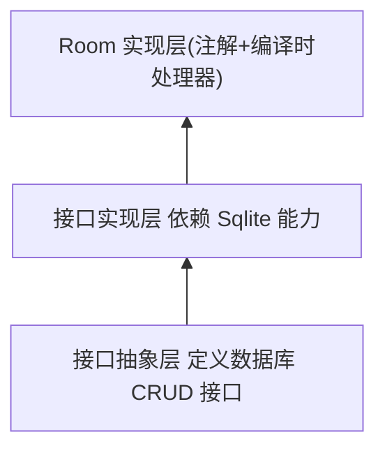

# Room



## 注解 及 使用

### 表

- @@Entity(tableName = "book")
  - @PrimaryKey(autoGenerate = true) 主键 自增
  - @ColumnInfo(name = "qwe", defaultValue="123") 用于标记实体类中的列信息，可以自定义列名、默认值等。
  - @Ignore 用于标记实体类中不需要持久化的字段或方法
  - @Embedded 用于将一个实体类嵌入到另一个实体类中

```
@Entity(tableName = "book")
data class Book(
    @PrimaryKey(autoGenerate = true)
    val id: Long = 0,
    var name: String,
    var price: Double
)
```

- @Relation: 用于定义实体类之间的关系，例如一对多、多对一、多对多等。

```
@Entity(tableName = "user")
data class User(
    @PrimaryKey val id: Long,
    val name: String
)

@Entity(tableName = "book", foreignKeys = [ForeignKey(entity = User::class, parentColumns = ["id"], childColumns = ["userId"])])
data class Book(
    @PrimaryKey val id: Long,
    val title: String,
    val userId: Long
)

data class UserWithBooks(
    @Embedded val user: User,
    @Relation(parentColumn = "id", entityColumn = "userId")
    val books: List<Book>
)
```

### Dao

- @DAO
  - @Insert()
  - @Delete()
  - @Update()
  - @Query 可以以 LiveData 包含查询结果类 DomainData, 即 LiveData<DomainData>

- @Transaction: 用于标记需要在事务中执行的方法。用于标记 Dao 的方法

DAO 中的SQL从方法参数取参使用占位符 `:id`

```
@Dao
interface BookDao {

    @Query("SELECT * FROM book WHERE id = :id")
    fun getBookById(id: Long): Book?

    @Query("SELECT * FROM book")
    fun getAllBooks(): List<Book>

    @Insert
    fun insertBook(book: Book)

    @Update
    fun updateBook(book: Book)

    @Delete
    fun deleteBook(book: Book)

    // 删除所有
    // 使用 @Query 注解来指定 SQL 查询语句，并在查询中使用 DELETE FROM users 来删除所有用户数据
    @Query("DELETE FROM book")
    fun clearAllBooks()

}
```

新版的 Dao 里的方法不能加 suspend, 加了会报错 (比较)，使用时直接在 Repository 层异步调用就行

### 数据库

- @Database 用于标记抽象类，作为数据库的主要访问点。需要指定实体类和数据库版本号。

```
@Database(entities = [Book::class], version = 1)
abstract class MyDatabase : RoomDatabase() {

    abstract fun bookDao(): BookDao

}
```

### 操作

获取 数据库 和 Dao 实例

```
// 初始化数据库
private val db by lazy {
    Room.databaseBuilder(
        this, MyDatabase::class.java, "my-database"
    ).build()
}

// 使用数据库
private val bookDao by lazy { db.bookDao() }
```

增删改查

```
// 插入数据
lifecycleScope.launch(Dispatchers.IO) {
    val book = Book(
        name = "Android Programming",
        price = 29.99,
    )
    bookDao.insertBook(book)
}

// 查询数据
lifecycleScope.launch(Dispatchers.IO) {
    val books = bookDao.getAllBooks()
    val text = books.joinToString(", \n") { GsonUtils.toJson(it) }
    LogUtils.e(text)
}

// 更新数据
lifecycleScope.launch(Dispatchers.IO) {
//    val book = Book(id = 2, name = "Android Programming", price = 29.99)
    val book = bookDao.getBookById(2) ?: return@launch
    book.price = 39.99
    bookDao.updateBook(book)
}

lifecycleScope.launch(Dispatchers.IO) {
    val book = Book(
        id = 1,
        name = "法外狂徒张三",
        price = 19.99,
    )
    bookDao.updateBook(book)
}

// 删除数据
lifecycleScope.launch(Dispatchers.IO) {
    val book = bookDao.getBookById(3) ?: return@launch
    bookDao.deleteBook(book)
}

lifecycleScope.launch(Dispatchers.IO) {
    bookDao.clearAllBooks()
}
```

实际使用时 在 repository 层调用 可以使用 viewModelScope
